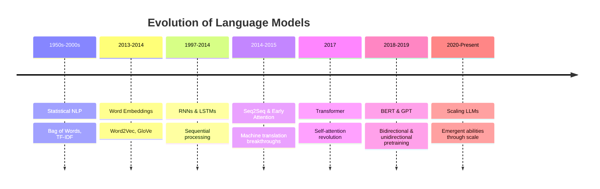
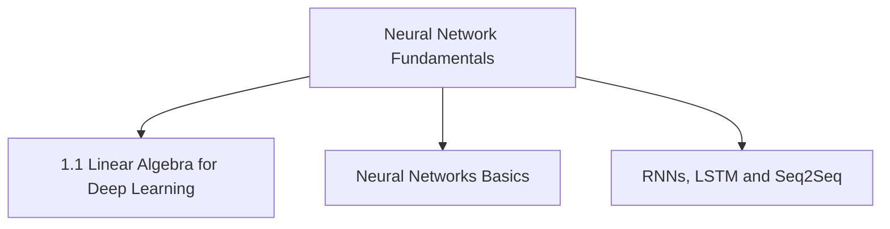

# **GenAI Playbook 2025: Visual and Hands-on LLM Learning**

  

## **Introduction**
This playbook provides an immersive, hands-on experience designed to deepen your understanding of Large Language Models (LLMs) and their applications. Through engaging visual explanations, interactive demonstrations, and practical implementations, you will discover the inner workings of these powerful models and learn how to apply them effectively in real-world scenarios. 

In addition to the learning path, this playbook keeps you up to date with the latest advancements in Generative AI by providing:

- 🧑‍🏫 **AI Experts to Follow**: Discover influential figures in the AI community and their contributions.
- 📰 **AI Newsletters**: Stay informed with curated newsletters that cover the latest trends and research in AI.
- 📚 **Open-Source AI Libraries & Frameworks**: Explore essential tools and libraries that facilitate your learning and project development.

## **Table of Contents**
- [LLM Learning Path](#llm-learning-course-2025)
- [AI Experts to Follow](#ai-experts-to-follow)
- [AI Newsletters](#ai-newsletters)
- [Open-Source AI Libraries & Frameworks](#open-source-ai-libraries-frameworks)
- [Contributing](#contributing)

## **LLM Learning course 2025**
Let's begin our journey with the Learning Path, where you will explore the foundational concepts and practical applications of Large Language Models.

### **Which sections should you focus on?**

| **Beginner Track** | **Advanced Track** |
|-------------------------|----------------------------|
| **Prerequisite**: Basic understanding of AI/ML or Data Science | **Prerequisite**: Proficiency in AI/ML with a solid grasp of Neural Networks |
| ✓ Start with Section 0: Evolution of LLMs | ✓ Start with Section 0: Evolution of LLMs |
| ✓ Continue with Section 1: Neural Network Fundamentals | ✓ Skip Section 1 (Neural Network Refresher) and jump to Section 2: LLM Architecture |
| ✓ Follow the entire learning path sequentially; you can skip topics marked as intermediate or advanced | ✓ Follow the remaining sections sequentially |
| ✓ Take time to build foundations with hands-on practice | ✓ Focus on advanced techniques and implementations |
| **Expected Time to Complete**: 8 weeks | **Expected Time to Complete**: 5 weeks |

### **What You Will Learn**

By completing this visual and hands-on learning journey, you will:

- ✅ **Master the foundations of LLMs** - Understand the evolution and inner workings of language models through visual explanations and interactive demonstrations
- ✅ **Build practical skills through hands-on implementation** - Move beyond theory with guided notebooks and code examples that solidify your understanding
- ✅ **Create powerful LLM applications** - Learn essential techniques like prompt engineering, RAG, AI Agents, and fine-tuning to build solutions for real-world problems
- ✅ **Deploy production-ready systems** - Take your projects from experimentation to implementation with deployment best practices

Each section includes visual explanations, interactive tools, and practical implementation examples that help you build both theoretical understanding and hands-on skills.

To enhance your learning experience, we have organized the resources within each topic into three broad tiers: **basic, intermediate, and advanced**. These categories have been carefully crafted based on our overall assessment of each resource's complexity and common learning progressions, while also recognizing that every learner brings a unique background—a resource we label as "basic" might feel intermediate or even challenging for some, yet appear straightforward for others. This flexible framework is intended to guide you in adapting the order and pace to match your understanding and needs. With that in mind, the resources are presented in the following key areas:
1. **Visual explanations** - Articles and videos that illustrate concepts visually.
2. **Interactive tools** - Visualizations and playgrounds to build intuition.
3. **Practical implementations** - Notebooks and code examples for hands-on learning.
4. **Further reading** - Additional resources for deeper exploration.

### **LLM Course Overview**

As you embark on this journey, it's essential to recognize that Large Language Models (LLMs) represent the culmination of decades of progress in deep learning and natural language processing. To truly master these models, you need to understand not just how to use them, but also how they function at a fundamental level. 

This learning path is designed to build your knowledge progressively, guiding you through the essential concepts and techniques. Each section is crafted to enhance your understanding and skills, leading you to become proficient in LLM applications. 

Let's explore the sections that will shape your learning experience:

**[Section 0: Evolution of LLMs](#section-0-evolution-of-language-models-the-path-to-llms)**
- Understand the historical evolution of language models—from early statistical methods to modern transformers. This section provides crucial context for appreciating the innovations that made modern LLMs possible.

**[Section 1: Neural Network Fundamentals](#section-1-neural-network-fundamentals)**
- Refresh your understanding of neural networks, the building blocks of LLMs. This section covers fundamentals including linear algebra, basic neural network learning, and RNNs for sequence modeling.

**[Section 2: LLM Architecture and Core Concepts](#section-2-llm-architecture-and-core-concepts)**
- Dive into the core components of LLMs including pre-LLM language understanding, word embeddings, transformer architecture, and advanced transformer concepts.

**[Section 3: LLM-based Applications](#section-3-llm-based-applications)**
- Learn practical techniques for applying LLMs including prompt engineering (both basic and advanced), and Retrieval-Augmented Generation (RAG). Also explore practical frameworks like LangChain.

**[Section 4: Multimodal LLMs and SLMs](#section-4-multimodal-llms-and-slms)**
- Explore advanced applications that extend beyond text, including multimodal language models and Small Language Models (SLMs). This section covers agents and interactions across modalities.

**[Section 5: Fine-Tuning LLMs](#section-5-fine-tuning-llms)**
- Understand how to fine-tune LLMs for specific tasks, including techniques like LoRA for efficient adaptation.

**[Section 6: LLM Deployment](#section-6-llm-deployment)**
- Gain insights into deploying LLMs in production, covering API deployment, monitoring, and end-to-end pipelines.

Below, the content is reorganized to reflect this structure:

---

### **Section 0: Evolution of Language Models: The Path to LLMs**

> **Beginner's Note**: For those new to AI/ML or needing a refresher on neural networks, some concepts in this section may seem complex. This overview aims to help you understand the evolution of language models. Concentrate on the overarching ideas and intuitions; detailed discussions on neural networks will be addressed in the subsequent section.

> 📌 **Overview Note**: This section summarizes the historical development of language models. For in-depth explanations of specific methodologies, please consult the relevant sections that follow. Additionally, if you're seeking a deeper mathematical and technical understanding, the linked research papers are valuable resources.

Understanding Large Language Models requires appreciating the evolution of technologies that made them possible. This journey spans decades of research and represents the progressive solving of increasingly complex language understanding problems.

#### **The Foundational Building Blocks**

To effectively understand and utilize Large Language Models (LLMs), it's crucial to start with the foundational concepts of language modeling. Language modeling is the process of predicting the next word in a sequence given the previous words based on probabilities, which is essential for tasks such as text generation, translation, and summarization. By grasping these fundamental principles, learners can appreciate how LLMs have evolved and why they function the way they do.

The learning path is designed with the assumption that a basic understanding of machine learning concepts is already established. This foundational knowledge serves as a basis for exploring neural networks and deep learning, facilitating the examination of subsequent innovations in language modeling. Such an understanding paves the way for developing more sophisticated models capable of comprehending and generating human-like text.

As we transition into the specifics of how these models process language, we encounter the critical concepts of **Tokenization & Word Representations**. Early NLP systems struggled with representing text in a way machines could process, which led to several key developments:
- **Tokenization**: Breaking text into manageable units (words, subwords, or characters) to facilitate analysis and processing.
- **Bag-of-Words/TF-IDF**: Simple statistical methods that treated texts as unordered collections of words, providing a basic understanding of text structure.
- **Word Embeddings (Word2Vec, GloVe)**: Revolutionary techniques that represent words as dense vectors in a continuous space, capturing semantic relationships between words mathematically. These embeddings are often generated using deep neural networks, allowing models to understand context and meaning more effectively.

> 🌟 **Word2Vec (2013)** was a **transformative breakthrough** in NLP! It allowed words with similar meanings to **naturally cluster** together in vector space. For the first time, machines could perform operations like ➡️ **"king - man + woman = queen"** to capture semantic relationships purely through mathematical operations.
> 
> ⚠️ **However**, while this innovation sparked our initial intuition about language, relying solely on static embeddings (like those from Word2Vec and GloVe) reveals a **significant limitation**: they do not capture **context**.
> 
> 🔍 For instance, the word **"bank"** could refer to either a **financial institution** 💰 or the **side of a river** 🌊, yet a static embedding treats these meanings identically. This limitation clearly highlights the need for **contextual embeddings** that adapt based on neighboring words.

Transitioning from these early static methods, we now set the stage for a discussion on more advanced techniques. In the upcoming Section 2: LLM Architecture and Core Concepts, you will find an intuitive, visual breakdown of these ideas. In the meantime, if you're eager to delve into the foundational research behind these breakthroughs, please refer to the key papers below:

**Key Papers:**
- [Efficient Estimation of Word Representations in Vector Space (Mikolov et al., 2013)](https://arxiv.org/abs/1301.3781) – Original Word2Vec paper
- [GloVe: Global Vectors for Word Representation (Pennington et al., 2014)](https://nlp.stanford.edu/pubs/glove.pdf) – Stanford's GloVe embeddings

Building on the evolution from static word representations, deep learning introduced models that tackled language's unique sequential challenges in stages.

• **Recurrent Neural Networks (RNNs)** were a groundbreaking advancement in addressing the limitations of static word embeddings like Word2Vec by introducing the concept of sequential processing. Unlike Word2Vec, which generates fixed representations without considering the structure of sentences, RNNs maintain context through hidden states that carry information from previous tokens in a sequence. This capability allows RNNs to effectively model the natural order of language, understanding dependencies and meaning across time steps, making them particularly suited for tasks such as language modeling and text generation. However, despite their innovative approach, standard RNNs still face challenges with long-term dependencies due to the [vanishing gradient problem](https://www.youtube.com/watch?v=qowp6SQ9_Oo), a limitation that later architectures like LSTMs and GRUs sought to overcome.

• **Long Short-Term Memory networks (LSTMs)** improved upon RNNs by introducing gating mechanisms—input, forget, and output gates—that selectively regulate the flow of information, allowing them to retain important context over long sequences. This enhancement helped mitigate the vanishing gradient problem, enabling LSTMs to capture long-term dependencies more effectively. However, LSTMs still process sequences sequentially, which slows down training and makes it computationally expensive to link distant words, especially in long texts.

*As an example, consider the sentence:*

👉 *I grew up in France, so I speak fluent French.*

  *A vanilla RNN processes words one by one, but due to the vanishing gradient problem, by the time it reaches *"French,"* it may have forgotten the earlier *"France"* context. As a result, it might struggle to predict that *"French"* is the expected language.*

*How LSTMs Improve This*

*LSTMs, with their forget and input gates, selectively retain important information. Here's how it works:
 1. *"I grew up in France"* → The model stores *"France"* in memory
 2. *"so I speak fluent"* → The forget gate filters out less relevant details but keeps *"France"* in memory.
 3. *"French"* → When predicting this word, the LSTM remembers the earlier mention of France, leading to a more accurate prediction.*

*Why This Matters : Unlike standard RNNs, which may lose context over long sentences, LSTMs effectively retain key information, making them better for tasks like language modeling, machine translation, and speech recognition.*

• **Seq2Seq** models marked a significant advancement in language modeling by employing an **encoder-decoder framework**. This architecture effectively transformed variable-length input sequences into a fixed-size context vector, making it particularly suitable for tasks such as machine translation. However, this approach introduced an information bottleneck, especially for longer sequences, as compressing an entire sentence into a single vector can lead to loss of important contextual information.

• To address this limitation, **early attention mechanisms** were integrated into Seq2Seq architectures, allowing decoders to dynamically focus on different segments of the input. While this innovation improved the handling of context, it still depended on sequential processing, which posed challenges related to speed and the ability to capture global context effectively. The introduction of the **Transformer architecture** further revolutionized this field by replacing recurrence with self-attention, enabling parallel processing and better handling of long-range dependencies in data. This advancement has been pivotal in the development of modern machine translation systems, as highlighted in the TensorFlow tutorial on Transformers, which demonstrates their application in translating text efficiently (source: [TensorFlow](https://www.tensorflow.org/text/tutorials/transformer)).

The breakthrough arrived with the **Transformer architecture (2017)**, which replaced recurrence (RNNs) entirely with a self-attention mechanism. This innovation enabled every word in a sequence to interact directly with every other word in parallel—overcoming sequential processing constraints, accelerating training, and capturing global dependencies more effectively.

> #### 🚀 **Self-Attention: The Game-Changer!** 
> 
> Self-attention was the genuine breakthrough in NLP! Unlike previous attention mechanisms that operated within sequential models, **self-attention** allowed for **direct modeling of relationships** between **all words** in a sequence simultaneously. This innovation **parallelized** what was previously sequential, **dramatically speeding up training** and enabling **much larger models**. By computing attention scores between **every token** and **every other token** in a sequence, Transformers could process **entire texts at once**, capturing **complex relationships** regardless of distance.

**Key Papers:**
- [Attention Is All You Need (Vaswani et al., 2017)](https://arxiv.org/abs/1706.03762) - The landmark Transformer paper
- [BERT: Pre-training of Deep Bidirectional Transformers for Language Understanding (Devlin et al., 2018)](https://arxiv.org/abs/1810.04805) - Bidirectional adaptation of the Transformer

**Scaling to LLMs (2018-Present)**: With the transformer architecture in place, researchers discovered that increasing model size, training data, and compute led to emergent capabilities:
- **BERT (2018)**: Bidirectional training that significantly improved language understanding by allowing the model to consider context from both directions. This addressed a major limitation of autoregressive models like GPT, which could only look at previous tokens.
- **GPT series (2018-2023)**: Each generation showed that scaling up transformers unlocked new capabilities
- **Scaling Laws**: Research revealed predictable improvements in performance based on model size, data, and compute

> The key insight of the LLM era is that many capabilities emerge naturally from scale rather than from new architectures or algorithms. Models became more factual, better at reasoning, and could follow instructions more precisely simply by getting larger.

**Key Papers:**
- [Language Models are Few-Shot Learners (Brown et al., 2020)](https://arxiv.org/abs/2005.14165) - GPT-3 
paper introducing emergent capabilities
- [Training language models to follow instructions with human feedback (Ouyang et al., 2022)](https://arxiv.
org/abs/2203.02155) - RLHF for alignment
- [Scaling Laws for Neural Language Models (Kaplan et al., 2020)](https://arxiv.org/abs/2001.08361) - 
Relationship between scale and performance

#### Key Takeaways

This progression from simple statistical methods to sophisticated neural architectures reflects a journey of solving increasingly difficult language understanding problems. Not only did each innovation address limitations of its predecessor, but each also introduced key differences that paved the way for modern LLMs. Here's a quick summary of the key takeaways to remember:

1️⃣ Word2Vec → Created static word embeddings that capture semantic meaning, but each word was assigned one fixed vector without context (e.g., "bank" as a riverbank versus a financial institution).

2️⃣ RNN → Introduced sequential processing to handle context by processing words one at a time, which improved context handling but suffered from vanishing gradients and difficulties in maintaining long-term dependencies.

3️⃣ LSTM → Enhanced RNNs by incorporating gating mechanisms (forget, input, output) to selectively preserve important information in longer sequences, though still operating sequentially and thus more slowly.

4️⃣ Seq2Seq → Utilized an encoder-decoder architecture to manage variable-length inputs and outputs, yet compressed the entire sentence into a single fixed context vector, which could lead to information loss in longer texts.

5️⃣ Attention Mechanism → Allowed the decoder to "look back" at multiple encoder vectors (one per word) instead of relying on one fixed vector, thereby preserving long-range dependencies more effectively.

6️⃣ Transformer → Revolutionized processing by removing RNNs completely and adopting self-attention; every token interacts with all others in parallel, making training faster and significantly better at capturing long-range dependencies.

🔥 These breakthroughs ultimately led to the emergence of modern language models like BERT, GPT, and ChatGPT!

Understanding this evolution and the key differences behind each discovery provides the context for why LLMs work the way they do and for the specific design choices in today's models. As you progress through this playbook, you'll explore these concepts in greater depth and see how all these advancements contribute to the remarkable capabilities of modern language models.

> 🔄 Moving from History to Implementation: Now that you have a concise summary of the evolution of language models, let's dive into the foundational neural network concepts that power them. This context will help you appreciate the rationale behind the architectural choices in modern LLMs.
>
> 🔍 Navigation Tip: If you already have experience with neural networks and deep learning fundamentals, feel free to skip directly to [Section 2: LLM Architecture and Core Concepts](#section-2-llm-architecture-and-core-concepts) as indicated in the "Choose Your Learning Path" table.

### **Section 1: Neural Network Fundamentals**

> ⚠️ **Optional Section**: This section is primarily for those new to neural networks or those who want a refresher. As mentioned in the learning path table, if you're already comfortable with neural network concepts, you can skip to Section 2.

#### **1.1 Linear Algebra for Deep Learning (Basic)**

> 📌 **Note**: If you already have a strong background in linear algebra and math fundamentals, you can skip this subsection and move directly to Section 1.2.

**Why this matters**: Linear algebra is the mathematical language of deep learning. Vectors, matrices, and tensor operations form the core computations of neural networks and LLMs.

**How it connects**: Every operation in a neural network—from simple feedforward calculations to complex attention mechanisms in transformers—relies on linear algebra. Understanding these concepts visually will help you grasp how information flows through LLMs.

**Explore these resources to build your linear algebra foundation:**
- ▶️ [3Blue1Brown: Essence of Linear Algebra](https://www.youtube.com/playlist?list=PLZHQObOWTQDPD3MizzM2xVFitgF8hE_ab) - Visual explanations of critical math concepts
- 📓 [Visual Linear Algebra Notebook](https://colab.research.google.com/github/fastai/numerical-linear-algebra/blob/master/nbs/1.%20Why%20are%20we%20here.ipynb) - Practical implementation with visualizations.

#### **1.2 Neural Networks and Learning (Basic)**

**Why this matters**: Neural networks are the foundation of all modern AI systems, including LLMs. Understanding both their structure and how they learn through backpropagation is essential for grasping more complex architectures.

**How it connects**: All LLMs are ultimately neural networks with specialized architectures. The concepts you learn here—like weights, biases, activation functions, and gradient descent—form the core principles that enable these models to function and improve through training.

**Start with these resources to understand neural network basics:**
- ▶️ [3Blue1Brown: Neural Networks](https://www.youtube.com/watch?v=aircAruvnKk&list=PLZHQObOWTQDNU6R1_67000Dx_ZCJB-3pi&index=1&pp=iAQB) - But what is a neural network? | Deep learning chapter 1
- ▶️ [3Blue1Brown: Gradient Descent](https://www.youtube.com/watch?v=IHZwWFHWa-w&list=PLZHQObOWTQDNU6R1_67000Dx_ZCJB-3pi&index=2) - How neural networks learn | Deep learning chapter 2
- 🎮 [Neural Network Playground](https://playground.tensorflow.org/) - Interactive visualization to build intuition

**Then deepen your understanding with these hands-on implementations:**
- 📓 [Simple Neural Network from Scratch](https://colab.research.google.com/github/tensorflow/docs/blob/master/site/en/tutorials/quickstart/beginner.ipynb) - Build a basic neural network
- ▶️ [Excellent explanation on Back Propogation from ground up](https://www.youtube.com/watch?v=SmZmBKc7Lrs)
- 📄 [Visual Guide to Backpropagation](https://mattmazur.com/2015/03/17/a-step-by-step-backpropagation-example/) - Step-by-step visual walkthrough
- 📓 [Backpropagation Implementation Notebook](https://colab.research.google.com/github/tensorflow/docs/blob/master/site/en/tutorials/customization/custom_training_walkthrough.ipynb) - Practice implementing the learning process

#### **1.3 RNNs and Sequence Modeling (Intermediate)**

> 📈 **Intermediate Content**: Building on foundational neural network concepts, this subsection introduces more advanced sequential models.

**Why this matters**: Before the advent of transformers, Recurrent Neural Networks (RNNs)—including improved variants like LSTMs and GRUs—were the primary architecture for processing sequential data such as text. These models played a crucial role in early NLP applications but were limited by issues like vanishing gradients and difficulty capturing long-term dependencies.

**How it connects**: The evolution from simple RNNs to more complex sequential models set the stage for the transformer architecture. Many foundational concepts from RNNs, such as hidden states and sequence processing, continue to inform the design and understanding of modern language models (LLMs).

**Explore these resources to strengthen your understanding of pre-transformer neural architectures:**
- 📄 [Understanding LSTM Networks](https://colah.github.io/posts/2015-08-Understanding-LSTMs/) — A visual guide to LSTMs and RNNs.
- 📓 [RNN Implementation Notebook](https://colab.research.google.com/github/tensorflow/docs/blob/master/site/en/tutorials/text/text_classification_rnn.ipynb) — A practical walkthrough of an RNN implementation.
- 📚 [Add your preferred resource for RNN architectures]

> 🔄 **Bridging to Modern Architectures**: With a solid foundation in neural networks and sequence modeling, you're now ready to explore the revolutionary transformer architecture that powers modern LLMs. This next leap addresses the limitations of RNNs and LSTMs, enabling efficient handling of long-range dependencies and parallel processing.

#### **1.4 Seq2Seq Models (Basic)**

**Why this matters**: Seq2Seq models were instrumental in tasks such as machine translation and text summarization by mapping input sequences to output sequences. Their key innovation—the encoder-decoder architecture—allowed for input and output sequences of varying lengths, marking a critical advancement prior to the widespread adoption of transformers.

**How it connects**: As a pivotal development in NLP, Seq2Seq models bridged the gap between earlier sequence models like RNNs and the more sophisticated transformer-based architectures used today. Understanding Seq2Seq mechanisms helps you appreciate the progression toward models that are both flexible and more effective at capturing complex language patterns.

**Learn about Seq2Seq models with these resources:**
- 📄 [Google Seq2Seq Framework](https://google.github.io/seq2seq/) — Official documentation and resources for Google's Seq2Seq framework.
- ▶️ [Sequence-to-Sequence (seq2seq) Encoder-Decoder Neural Networks, Clearly Explained!!! by StatQuest](https://www.youtube.com/watch?v=L8HKweZIOmg&t=778s)

---

### **Section 2: LLM Architecture and Core Concepts**

> 🌟 **Essential Section**: This section is critical for all learners regardless of background, as it covers the specific architecture and mechanisms behind modern LLMs.

LLMs represent a breakthrough in natural language processing, built on several key architectural innovations. This section takes you on a journey through these components, from basic text processing to the sophisticated mechanisms that enable modern language models to understand and generate human-like text.

We'll begin with how machines process text (tokenization), explore how words are represented mathematically (embeddings), dive into the revolutionary transformer architecture that powers all modern LLMs, and finally understand the capabilities and limitations of these powerful models.

## 2.1 Tokens and Embeddings

LLMs operate by transforming raw text into a numerical format suitable for computation. This process centers around **tokens** and their corresponding **embeddings**. Understanding these fundamental concepts is crucial for effectively utilizing and interpreting LLM outputs.

**Tokens: The Atomic Units of Language**

Tokens are the atomic units of text that LLMs process. Before a model can process text, it undergoes **tokenization**, the process of breaking down raw text into these smaller pieces. Tokens can range from entire words to subwords, individual characters, or even bytes. Modern tokenization techniques, like Byte Pair Encoding (BPE) and WordPiece, offer significant advantages. By splitting words into meaningful subword units, these methods efficiently handle rare or unseen words, representing them as combinations of known subword tokens. This contrasts with simpler approaches that might assign "unknown" tokens to out-of-vocabulary words. During tokenization, the original text is converted into a sequence of **token IDs**, the numerical representations that LLMs directly utilize. Special tokens, such as `[CLS]` (classification) for representing the start of a sequence in classification tasks and `[SEP]` (separator) for marking the division between segments in tasks like question answering, are also incorporated to structure the input.

**(Interactive Exploration):** Visualize tokenization and experiment with different text inputs using this tokenizer playground: [https://tiktokenizer.vercel.app](https://tiktokenizer.vercel.app)

**Embeddings: Mapping Tokens to Semantic Space**

Once tokenized, each token is mapped to a numerical vector in a high-dimensional space, known as its **embedding**. Embeddings encapsulate the semantic meaning of tokens. Tokens with similar meanings are positioned close to each other within this vector space. Early approaches, like Word2Vec, produced static embeddings, where each word consistently had a single, fixed vector representation regardless of context. However, the landscape has evolved significantly. Modern transformer models, the architectural backbone of most LLMs, generate **contextualized embeddings**. This means the vector representation of a token is not fixed but dynamically shifts based on the surrounding words and the overall context. These contextual embeddings are stored within an **embedding matrix**, and are continuously refined during the model's training. They are essential for a wide array of applications, including semantic search, recommendation systems, and more nuanced language understanding tasks.

The nature and application of embeddings vary depending on the underlying model architecture:

**Embeddings from Encoder-Only Models**

Encoder-only models, exemplified by models like BERT (Bidirectional Encoder Representations from Transformers), RoBERTa, SBERT (Sentence-BERT), and OpenAI's text-embedding models, are designed for deep, bidirectional contextual understanding. These models process the entire input text simultaneously, enabling them to generate rich embeddings that capture the semantic relationships within the entire sequence. This global perspective allows for a comprehensive representation of the input.

**Use Cases (Encoder-Only Embeddings):**

*   **Semantic Search:** Capturing the nuances of queries and documents, leading to more accurate and relevant information retrieval.
*   **Text Similarity & Clustering:** Grouping similar documents or detecting paraphrased sentences based on their embedding proximity.
*   **Question Answering (Retrieval-Based):** Identifying the answer within a given context, rather than generating a new response.

**Embeddings from Decoder-Only Models**

Decoder-only models, such as GPT (Generative Pre-trained Transformer), LLaMA, Claude, and Gemini, are optimized for text generation through next-token prediction. While they also generate embeddings, these are inherently more autoregressive in nature. They capture contextual dependencies in a unidirectional manner, typically from left to right, reflecting the model's predictive process. These embeddings primarily facilitate generation-based tasks rather than static representation tasks.

**Use Cases (Decoder-Only Embeddings):**

*   **Text Generation:** Creating human-like responses in chatbots, writing assistants, and content generation tools.
*   **Code Completion:** Generating code snippets by predicting the next tokens in a code sequence.
*   **Conversational AI:** Autoregressive embeddings are crucial for maintaining context and coherence over multiple turns in a conversation.

**Comparison: Encoder vs. Decoder Embeddings**

| Feature                     | Encoder-Only Models (BERT, OpenAI text-embedding) | Decoder-Only Models (GPT, Claude, Gemini)  |
| --------------------------- | ------------------------------------------------- | ----------------------------------------- |
| Contextual Understanding    | Bidirectional (captures meaning from both left & right context) | Unidirectional (focuses on predicting next token) |
| Primary Application        | Semantic search, text similarity, classification  | Text generation, dialogue systems          |
| Embedding Use              | Static embeddings for retrieval-based tasks     | Dynamic embeddings for generative tasks     |

In summary, both encoder and decoder embeddings are crucial components of modern AI. Encoder embeddings excel in semantic search and tasks requiring a comprehensive understanding of context, while decoder embeddings are better suited for generating text and maintaining context in dialogue systems. The choice between them depends on the specific application's requirements.

**Explore tokenization further with these resources:**
- 📄 [Tokens and Embeddings: The Hidden Language of LLMs](https://open.substack.com/pub/rohitkhattar/p/tokens-and-embeddings-the-hidden?r=1x1ytz&utm_campaign=post&utm_medium=web&showWelcomeOnShare=true)
- 📄 [Intro to Tokenization](https://huggingface.co/learn/nlp-course/chapter2/4?fw=pt) - Hugging Face's illustrated explanation
- 📄 [A Beginner’s Guide to Tokens, Vectors, and Embeddings in NLP](https://medium.com/@saschametzger/what-are-tokens-vectors-and-embeddings-how-do-you-create-them-e2a3e698e037)
- 📓 [Tokenization Implementation Notebook](https://colab.research.google.com/github/huggingface/notebooks/blob/main/examples/tokenizer_training.ipynb) - Hands-on tokenization

**Learn about word embeddings with these resources:**
- 📄 [Illustrated Word2Vec](https://jalammar.github.io/illustrated-word2vec/) - Jay Alammar's visual guide to understanding word embeddings
- https://platform.openai.com/docs/guides/embeddings
- 📓 [Word Embeddings Jupyter Notebook](https://colab.research.google.com/github/tensorflow/docs/blob/master/site/en/tutorials/text/word_embeddings.ipynb) - Hands-on implementation of word embeddings

----

#### **2.3 Transformer Architecture**

> 🌟 **Core Concept**: The transformer architecture is the foundation of all modern LLMs. Understanding this architecture is essential for grasping how these models work.

>**Why this matters**: 
- The transformer architecture revolutionized natural language processing and forms the foundation of all modern LLMs. 
- Transformers excel at modeling sequential data, such as natural language, and are significantly more efficient than recurrent neural networks (RNNs) due to their parallelizable nature. 
- Unlike RNNs, which process data sequentially, transformers replace recurrence with attention mechanisms, allowing computations to occur simultaneously across layers. 
- This parallelization makes them highly efficient on hardware like GPUs and TPUs.
- Transformers can capture distant or long-range contexts and dependencies in the data, enabling them to learn longer connections effectively. 
- Each location in the input has access to the entire sequence at each layer, which contrasts with RNNs and convolutional neural networks (CNNs) that require information to pass through multiple processing steps to reach distant positions. 
- This capability allows transformers to make no assumptions about the temporal or spatial relationships across the data, making them ideal for processing complex sets of objects, such as StarCraft units. 
- Understanding how attention mechanisms work is crucial for grasping the capabilities of LLMs.

**How it connects**: Every modern LLM—from GPT to Llama to Claude—is built on transformer architecture. This section connects your neural network fundamentals to the specific architecture that powers today's most powerful AI systems.

##### **2.3.1 Basic Transformer Concepts**

**Dive into these resources to understand the high-level architecture behind modern LLMs:**
- 📄 [The Illustrated Transformer](https://jalammar.github.io/illustrated-transformer/) - Jay Alammar's classic visual explanation
- 📄 [The Illustrated BERT](https://jalammar.github.io/illustrated-bert/) - Jay Alammar's visual explanation of BERT architecture
- 🎮 [Interactive Transformer Visualization](https://bbycroft.net/llm) - Step-by-step visual walkthrough
- 📚 [Add your preferred resource for understanding transformer architecture]

These resources will help you understand the basic structure of transformer models (encoder-decoder or decoder-only), key components like attention heads, feed-forward networks, and normalization layers, and how positional encoding allows transformers to understand word order. Additionally, they will clarify the input-output flow of information through the model and illustrate how transformers revolutionized machine translation by processing entire sequences in parallel. 

Building on this foundational knowledge, the following table provides a comparative overview of different NLP architectures, including Seq2Seq models, the Transformer framework, BERT, and GPT. It highlights their architecture type, purpose, working mechanism, primary use cases, and key differences, helping you understand how these models evolved and where they are best applied in real-world AI tasks.

| **Model**       | **Architecture Type**  | **Purpose** | **How It Works** | **Use Cases** | **Key Differences** |
|---------------|------------------|----------|--------------|------------|----------------|
| **Seq2Seq (Encoder-Decoder RNNs)** | RNN-based Encoder-Decoder | Sequence-to-sequence tasks like translation and summarization | Uses an encoder to process input and a decoder to generate output. Often enhanced with attention mechanisms. | Machine Translation (Google Translate), Text Summarization, Speech-to-Text | Struggles with long-range dependencies due to sequential processing; slow inference speed. |
| **Transformers** (Vaswani et al., 2017) | Self-Attention Mechanism (Encoder-Decoder) | General framework for NLP tasks | Uses **self-attention** to process input in parallel, avoiding sequential bottlenecks in RNNs. Can be encoder-only, decoder-only, or both. | Machine Translation, Text Generation, Question Answering, RAG | Faster and more efficient than RNNs; eliminates recurrence and processes text in parallel. |
| **BERT (Bidirectional Encoder Representations from Transformers)** | Transformer Encoder-Only | **Understanding & Embeddings (not generation)** | Trained using **Masked Language Modeling (MLM)** and **Next Sentence Prediction (NSP)**. Processes text bidirectionally to understand meaning in context. | Search engines (Google Search), Sentiment Analysis, Named Entity Recognition (NER), RAG | **Not generative** (can’t produce free text); better for understanding and classification. |
| **GPT (Generative Pre-trained Transformer)** | Transformer Decoder-Only | **Text Generation & Reasoning** | Trained autoregressively to predict the **next word** in a sentence. Uses **causal attention** (looks only at past tokens). | Chatbots, Creative Writing, Code Generation, LLM Applications (GPT-4, Claude, etc.) | **Not bidirectional** like BERT; better for **generation**, but weaker at deep text understanding. |

##### **2.3.2 Advanced Transformer Concepts**

> 🚀 **Advanced Content**: This subsection explores cutting-edge concepts that even experienced practitioners might find challenging. Feel free to skim on first reading and return later as you build experience.

**Dive deeper into transformer mechanics with these resources:**
- 🎮 [LLM Visualization Toolkit](https://github.com/bbycroft/llm-viz) - Tools for visualizing LLM operations
- 📓 [Transformers from Scratch Notebook](https://colab.research.google.com/github/huggingface/notebooks/blob/main/examples/annotated_encoder_decoder.ipynb) - Build a transformer model step by step
- 📄 [Attention Is All You Need](https://arxiv.org/abs/1706.03762) - The original transformer paper with detailed architecture
- 📚 [Add your preferred resource for understanding advanced transformer mechanisms]

These resources will help you understand:
- The detailed mathematics behind self-attention mechanisms
- How multi-head attention works and why it's important
- The training process for transformer models
- Performance optimizations and architectural variants
- Advanced concepts like sparse attention and efficient implementations

#### **2.4 LLM Foundation and Architecture**

> 🏗️ **Building on Transformers**: This section explores how transformers evolved into the powerful language models we use today.

**Why this matters**: Understanding the foundational architecture of LLMs helps you grasp how they achieve their remarkable capabilities and where their limitations come from.

**How it connects**: This knowledge bridges the gap between basic transformer architecture and modern LLM applications, showing how scaling and architectural improvements led to today's powerful models.

**Explore LLM foundations with these resources:**
- ▶️ [LLM Architecture Explained](https://www.youtube.com/watch?v=zjkBMFhNj_g) - Visual breakdown of modern LLM architecture
- 📓 [Understanding LLM Components](https://colab.research.google.com/github/huggingface/notebooks/blob/main/getting_started/quicktour.ipynb) - Hands-on exploration of LLM internals
- 📄 [From Transformers to LLMs](https://www.anthropic.com/research/a-mechanistic-understanding-of-emergent-abilities-in-llms) - Visual explanation of architectural evolution
- ▶️ [Andrej Karpathy - State of GPT](https://www.youtube.com/watch?v=bZQun8Y4L2A) - Overview of the GPT training pipeline, including tokenization, pretraining, and RLHF, along with practical techniques for effective model use.

#### **2.5 LLM Capabilities and Limitations (Basic)**

**Why this matters**: Understanding what LLMs can and cannot do helps you develop realistic expectations and design more effective applications.

**How it connects**: This knowledge forms your mental model of LLMs as text prediction systems, helping you leverage their strengths while mitigating their weaknesses in practical applications.

**Explore LLM capabilities with these resources:**
- ▶️ [LLM Basics Explained Visually](https://www.youtube.com/watch?v=zjkBMFhNj_g) - Simple visual introduction to LLMs
- 📓 [Using Pre-trained LLMs Notebook](https://colab.research.google.com/github/huggingface/notebooks/blob/main/getting_started/quicktour.ipynb) - Hands-on introduction to working with LLMs
- 📄 [Understanding Emergent Abilities](https://www.anthropic.com/research/a-mechanistic-understanding-of-emergent-abilities-in-llms) - Visual explanation of scale effects in LLMs
- 📚 [Add your preferred resource for understanding LLM capabilities and limitations]

#### **2.6 Scaling Laws and LLM Training (Advanced)**

> 🚀 **Advanced Content**: This subsection explores how LLMs are trained and how their performance scales with size and data.

**Why this matters**: Understanding scaling laws helps explain why larger models tend to perform better and provides insight into the future direction of LLM development.

**How it connects**: These concepts explain why recent models like GPT-4 and Claude 3 perform so well and what we might expect from future models.

**Learn about LLM scaling with these resources:**
- 📄 [Scaling Laws Visualized](https://lilianweng.github.io/posts/2023-01-10-scaling-law/) - Visual explanation of how model performance scales with size and data
- ▶️ [Andrej Karpathy - Deep Dive into Training](https://www.youtube.com/watch?v=7xTGNNLPyMI) - Comprehensive visual breakdown of LLM training
- 📓 [Creating and Visualizing Contextual Embeddings Notebook](https://colab.research.google.com/github/tensorflow/text/blob/master/docs/tutorials/bert_glue.ipynb) - Practical implementation
- 📚 [Add your preferred resource for understanding LLM scaling and training]

> 🔄 **From Theory to Practice**: Now that you understand how LLMs work under the hood, let's explore how to actually use them to solve real problems. Section 3 shifts our focus from architecture to application, showing you practical techniques to get the most out of these powerful models.

---

### **Section 3: LLM-based Applications**

> 💼 **Practical Application Focus**: This section transitions from understanding how LLMs work to applying them to solve real-world problems.

LLM-based applications are systems that leverage the capabilities of large language models to perform useful tasks. These range from simple chatbots (like ChatGPT) to complex document analysis tools, creative writing assistants, code generation systems, and intelligent agents that can interact with other systems.

This section focuses on how to effectively harness these powerful models to build practical applications that solve real-world problems. We'll explore techniques from basic prompting to advanced agent architectures that can reason, plan, and execute complex tasks.

#### **3.1 Prompt Engineering Fundamentals (Basic)**

> 🔰 **Beginner-Friendly**: This subsection is accessible to all learners and provides immediate practical value, even without deep understanding of LLM architecture.

**Why this matters**: Effective prompt design is the simplest way to improve LLM outputs without changing the model itself. These techniques help you communicate more effectively with LLMs to get the results you want.

**How it connects**: Prompt engineering is often the first and most accessible way to customize LLM behavior. The techniques you learn here will be valuable regardless of which models or frameworks you use later.

**Learn effective prompting with these resources:**
- 🔍 [Visual Guide to Prompt Engineering](https://www.promptingguide.ai/) - Illustrated techniques for effective prompting
- 📓 [Prompt Engineering Patterns Notebook](https://colab.research.google.com/github/openai/openai-cookbook/blob/main/examples/How_to_format_inputs_to_ChatGPT_models.ipynb) - Practical implementation of prompt patterns
- 📚 [Add your preferred resource for advanced prompt engineering]

#### **3.2 Advanced Prompt Engineering (Intermediate)**

> 📈 **Intermediate Content**: These techniques build on basic prompting knowledge but don't require deep technical expertise to apply.

**Why this matters**: Advanced prompt engineering goes beyond basic instructions to explore techniques like chain-of-thought reasoning, few-shot learning, and optimization strategies that dramatically improve LLM performance on complex tasks.

**How it connects**: These techniques help you extract the maximum performance from existing models without fine-tuning, making them essential skills for any LLM practitioner.

**Master advanced prompting with these resources:**
- 🧠 [Chain-of-Thought Prompting Illustrated](https://www.promptingguide.ai/techniques/cot) - Visual explanation of reasoning techniques
- 📊 [Advanced Prompting Patterns Visualized](https://lilianweng.github.io/posts/2023-03-15-prompt-engineering/) - Lilian Weng's visual guide
- 📓 [Advanced Prompting Techniques Notebook](https://colab.research.google.com/github/openai/openai-cookbook/blob/main/examples/How_to_write_chain-of-thought_prompts.ipynb) - Practical implementation
- 📚 [Add your preferred resource for cutting-edge prompt engineering research]

#### **3.3 RAG Techniques (Intermediate)**

> 📈 **Intermediate Content**: RAG represents one of the most important practical applications of LLMs and is worth understanding even if you skipped some earlier sections.

**Why this matters**: Retrieval-Augmented Generation (RAG) solves one of the biggest limitations of LLMs: their limited knowledge and tendency to hallucinate. This technique combines the power of search with generation to create more accurate responses.

**How it connects**: RAG is one of the most important practical applications of LLMs, allowing you to ground model outputs in your own data. This technique forms the foundation for many real-world LLM applications, from chatbots to document analysis systems.

**Learn about RAG through these beginner-friendly resources:**
- 🌐 [Introduction to RAG with Visualizations](https://weaviate.io/blog/introduction-to-rag) - Visual explanation of RAG architecture
- 📓 [Simple RAG Implementation Notebook](https://colab.research.google.com/github/pinecone-io/examples/blob/master/learn/generation/langchain/handbook/08-langchain-retrieval-augmentation.ipynb) - Basic RAG implementation
- 📚 [Add your preferred resource for advanced RAG techniques]

*Basics of RAG:*
- Introduction to RAG with visual resources

*Advanced RAG Techniques:*
- Advanced implementations, including agentic RAG

[Include resources from previous sections accordingly]

#### **3.4 AI Agents**

##### **3.4.1 Basic Agent Concepts**

**Why this matters**: AI Agents represent a fundamental shift in how we use LLMs, moving from simple query-response to interactive systems that can understand, plan, and act.

**How it connects**: Basic agent concepts build on your understanding of prompting and RAG, showing how these techniques can be combined to create more capable AI systems.

**Learn about basic agent concepts:**
- 📄 [Introduction to LLM Agents](https://www.pinecone.io/learn/llm-agents/) - Visual explanation of agent fundamentals
- 📓 [Building Your First Agent](https://colab.research.google.com/github/langchain-ai/langchain/blob/master/docs/docs/tutorials/agents.ipynb) - Step-by-step implementation
- 🎮 [Agent Playground](https://python.langchain.com/docs/modules/agents/quick_start) - Interactive environment for experimenting with agents
- 📚 [Add your preferred resource for understanding basic agent concepts]

##### **3.4.2 Advanced Agent Architectures**

**Why this matters**: Advanced agent architectures enable more sophisticated behaviors like multi-step reasoning, tool use, and autonomous decision-making.

**How it connects**: These techniques build on basic agent concepts to create more powerful and autonomous systems.

**Explore advanced agent concepts:**
- 🎓 [AutoGPT: Agent-based LLM Applications](https://github.com/Significant-Gravitas/AutoGPT) - Popular open-source agent framework
- 🎲 [ReAct: Reasoning and Acting in Language Models](https://arxiv.org/abs/2210.03629) - Research on combining reasoning and acting
- 📓 [Advanced Agent Patterns](https://colab.research.google.com/github/langchain-ai/langchain/blob/master/docs/docs/tutorials/advanced_agents.ipynb) - Implementation of sophisticated agent architectures
- 📚 [Add your preferred resource for advanced agent architectures]

#### **3.5 LLM Frameworks (Intermediate)**

**Why this matters**: Frameworks like LangChain simplify building complex applications with LLMs. Learning these tools will help you quickly prototype and develop practical AI systems without reinventing the wheel.

**How it connects**: These frameworks bridge the gap between theoretical understanding and practical implementation, allowing you to apply everything you've learned about transformers and LLMs to build useful applications.

**Get started with LLM frameworks through these resources:**
- ▶️ [Introduction to LangChain](https://www.deeplearning.ai/short-courses/langchain-for-llm-application-development/) - DeepLearning.AI's visual guide
- 📓 [LangChain Quickstart Notebook](https://colab.research.google.com/github/langchain-ai/langchain/blob/master/docs/docs/tutorials/quickstart.ipynb) - Interactive implementation
- 📚 [Add your preferred resource for advanced framework workflows]

> 🔄 **Expanding Horizons**: Having mastered text-based LLM applications, let's explore how these models are evolving to understand and generate other types of content. Section 4 introduces cutting-edge multimodal capabilities that represent the frontier of AI development.

---

### **Section 4: Multimodal LLMs and SLMs**

> 🔮 **Frontier Technology**: This section covers the cutting edge of LLM development. These concepts may evolve rapidly as the field advances.

#### **4.1 Multimodal LLMs (Advanced)**

> 🚀 **Advanced Content**: This subsection explores how LLMs are expanding beyond text to understand images, audio, and other data types.

**Why this matters**: Modern LLMs are expanding beyond text to incorporate images, audio, and other modalities. Understanding multimodal architectures helps you build more versatile and powerful AI applications.

**How it connects**: These techniques represent the next evolution in LLM capabilities, allowing models to reason across different types of information just as humans do. They enable entirely new classes of applications beyond text-only interfaces.

**Dive into multimodal LLMs with these resources:**
- 🌉 [Understanding Multimodal LLMs](https://huggingface.co/blog/phi3-vl-demos) - Visual guide to multimodal models
- 📊 [Microsoft Phi-4 Multimodal](https://www.analyticsvidhya.com/blog/2025/02/microsoft-phi-4-multimodal/) - Visual breakdown of capabilities
- 📓 [Multimodal LLM Notebook](https://colab.research.google.com/github/huggingface/notebooks/blob/main/examples/visual_qa.ipynb) - Implementation of vision-language tasks
- 📚 [Add your preferred resource for cutting-edge multimodal architectures]

#### **4.2 Small Language Models (SLMs) (Advanced)**

> 🚀 **Advanced Content**: This subsection explores more specialized and efficient models that can run with fewer computational resources.

**Why this matters**: Small Language Models (SLMs) are specialized versions of LLMs that are optimized for specific tasks or domains. Understanding these models helps you build more efficient and specialized AI systems.

**How it connects**: These models are designed to handle specific types of information or tasks, making them ideal for applications where a general-purpose LLM might be too resource-intensive or when deployment on edge devices is necessary.

**Dive into SLMs with these resources:**
- 🌉 [Understanding SLMs](https://huggingface.co/blog/tiny-llamas) - Visual guide to Small Language Models
- 📊 [Microsoft Phi-3 SLM](https://www.analyticsvidhya.com/blog/2025/02/microsoft-phi-3-slm/) - Visual breakdown of capabilities
- 📓 [SLM Notebook](https://colab.research.google.com/github/huggingface/notebooks/blob/main/examples/inference_on_tiny_models.ipynb) - Implementation of SLM tasks
- 📚 [Add your preferred resource for cutting-edge SLM applications]

> 🔄 **Beyond Off-the-Shelf Models**: While you can achieve a lot with pre-trained models and clever prompting, sometimes you need to customize LLMs for specific tasks. Section 5 introduces techniques to adapt these powerful models to your unique requirements.

---

### **Section 5: Fine-Tuning LLMs**

> ⚙️ **Technical Specialization**: This section introduces more advanced techniques that typically require deeper technical knowledge and computational resources. These are valuable skills for specialized LLM applications.

#### **5.1 LLM Fine-Tuning (Advanced)**

> 🚀 **Advanced Content**: Fine-tuning represents a more technical aspect of working with LLMs and may require specialized knowledge and resources.

**Why this matters**: Fine-tuning allows you to customize LLMs for specific tasks or domains, enhancing their performance beyond what's possible with prompt engineering alone.

**How it connects**: These techniques help you create specialized models that excel at particular tasks, bridging the gap between general-purpose LLMs and the specific requirements of real-world applications.

**Master LLM fine-tuning with these resources:**
- 🎓 [Visual Guide to Fine-Tuning](https://docs.unsloth.ai/get-started/fine-tuning-guide) - Visual explanations of fine-tuning concepts
- 📓 [LoRA Fine-Tuning Visualization Notebook](https://colab.research.google.com/github/huggingface/peft/blob/main/examples/image_classification/image_classification_peft_lora.ipynb) - Visual explanation of LoRA
- 📓 [Llama-3.2 Conversational SFT Notebook](https://colab.research.google.com/github/unslothai/notebooks/blob/main/nb/Llama3.2_(1B_and_3B)-Conversational.ipynb) - Hands-on fine-tuning implementation
- 📚 [Add your preferred resource for parameter-efficient fine-tuning techniques]

#### **5.2 LLM Fine-Tuning Techniques (Advanced)**

**Why this matters**: Fine-tuning is a powerful technique for enhancing LLM performance, but it requires a deep understanding of the model and the task at hand.

**How it connects**: These advanced techniques help you fine-tune LLMs for specific tasks, leveraging the full potential of the model and the task-specific knowledge you've gained.

**Explore advanced fine-tuning techniques with these resources:**
- 🎓 [Advanced Fine-Tuning Techniques](https://www.deeplearning.ai/short-courses/fine-tuning-llms/) - DeepLearning.AI's visual guide
- 📓 [Fine-Tuning Notebook](https://colab.research.google.com/github/huggingface/peft/blob/main/examples/image_classification/image_classification_peft_lora.ipynb) - Practical implementation of advanced fine-tuning
- 📚 [Add your preferred resource for advanced fine-tuning techniques]

---

### **Section 6: LLM Evaluation**

> 📊 **Quality Assurance**: This section covers essential techniques for evaluating LLM performance and ensuring your applications meet quality standards.

#### **6.1 Evaluation Fundamentals**

**Why this matters**: Proper evaluation helps you understand model strengths and weaknesses, ensure reliability, and make informed decisions about model selection and deployment.

**How it connects**: These techniques help you assess and improve the quality of your LLM applications before deployment.

**Learn about LLM evaluation:**
- ▶️ [Guide to LLM Evaluation Metrics](https://www.deeplearning.ai/short-courses/evaluating-debugging-llms/) - Visual overview of evaluation techniques
- 📓 [Evaluation Toolkit](https://colab.research.google.com/github/huggingface/notebooks/blob/main/examples/evaluation.ipynb) - Hands-on implementation of evaluation metrics
- 📄 [Best Practices for Testing LLMs](https://www.rungalileo.io/blog/llm-testing-guide) - Comprehensive guide to evaluation
- 📚 [Add your preferred resource for LLM evaluation]

#### **6.2 Advanced Evaluation Techniques**

**Why this matters**: Advanced evaluation methods help you assess complex capabilities like reasoning, factuality, and safety.

**How it connects**: These techniques ensure your LLM applications are robust and reliable in production environments.

**Master advanced evaluation:**
- 📄 [Evaluating Complex Reasoning](https://arxiv.org/abs/2305.14675) - Research on assessing higher-order capabilities
- 📄 [Automated Evaluation Frameworks](https://github.com/EleutherAI/lm-evaluation-harness) - Tools for comprehensive testing
- 📓 [Advanced Metrics Implementation](https://colab.research.google.com/github/huggingface/notebooks/blob/main/examples/evaluation_metrics.ipynb) - Practical implementation
- 📚 [Add your preferred resource for advanced evaluation techniques]

> 🔄 **From Experimentation to Production**: The final piece of the LLM puzzle is taking your solutions from experimentation to production. Section 6 covers the essential skills needed to deploy your models in real-world environments.

---

### **Section 7: LLM Deployment**

> 🏭 **Production Focus**: This section bridges the gap between experimentation and real-world application. These skills are essential for putting your LLM knowledge to practical use.

#### **7.1 LLM Deployment (Intermediate)**

> 📈 **Intermediate Content**: This subsection covers practical skills for turning your prototype into a production application.

**Why this matters**: Even the most sophisticated LLM application is useless if users can't access it. Deployment takes your models from experimental notebooks to production-ready applications that others can use.

**How it connects**: This is the final step in the practical application journey, allowing you to share your LLM applications with users. These deployment skills apply to any LLM project, making them essential for putting your knowledge into practice.

**Learn about deployment with these resources:**
- 🏗️ [Introduction to LLM Deployment](https://www.deeplearning.ai/short-courses/deploying-llms/) - Andrew Ng's starter guide
- 📓 [Simple LLM API Deployment Notebook](https://colab.research.google.com/github/huggingface/notebooks/blob/main/examples/inference_api.ipynb) - Basic deployment walkthrough
- 📚 [Add your preferred resource for cloud deployment of LLM applications]

---

## **AI Experts to Follow**

> 👥 **Community Connection**: Learning doesn't happen in isolation. These experts provide ongoing insights and visual explanations that complement the resources in this playbook.

Learn from the best minds in AI through their visual content and practical tutorials:

- **Andrej Karpathy** — [@karpathy](https://twitter.com/karpathy) - Former Director of AI at Tesla, expert in deep learning with exceptional visual explanations
- **Andrew Ng** — [@AndrewYNg](https://twitter.com/AndrewYNg) - Co-founder of Coursera, founder of DeepLearning.AI, renowned for clear visual teaching
- **Jay Alammar** — [@jalammar](https://twitter.com/jalammar) - Creator of "The Illustrated Transformer" and other visual ML guides
- **Sebastian Raschka** — [@rasbt](https://twitter.com/rasbt) - [Personal website](https://sebastianraschka.com) with visual guides to ML concepts
- **Jerry Liu** — [@jerryjliu0](https://twitter.com/jerryjliu0) - Creator of LlamaIndex (formerly GPT Index) for LLM applications
- **Louis-François Bouchard** — [@Boucher_Louis](https://twitter.com/Boucher_Louis) - Co-founder at Towards AI, creates visual AI tutorials
- **Lilian Weng** — [@lilianweng](https://twitter.com/lilianweng) - Head of AI at OpenAI, creates visual explanations of complex AI concepts
- **Jeremy Howard** — [@jeremyphoward](https://twitter.com/jeremyphoward) - Co-founder of fast.ai, known for visual, practical deep learning courses
- **Grant Sanderson** — [@3blue1brown](https://twitter.com/3blue1brown) - Creator of 3Blue1Brown, makes incredible visual math and ML content
- **Yannic Kilcher** — [@ykilcher](https://twitter.com/ykilcher) - Research scientist who creates accessible explanations of ML papers
- 📚 [Add your own favorite AI educators who focus on visual explanations]

## **AI Newsletters**

Stay updated with visual explanations and practical insights:

- **[The Rundown AI](https://www.therundownai.com/)** - A 5-minute newsletter with visual explanations of AI news and practical application insights
- **[The Neuron](https://www.theneurondaily.com/)** - Daily AI newsletter with concise industry news, top AI tools, and free visual courses
- **[OpenAI Research](https://openai.com/news/research/)** - Latest research with visual explanations from OpenAI
- **[The Batch by DeepLearning.AI](https://www.deeplearning.ai/the-batch/)** - Andrew Ng's newsletter with visual explanations of AI concepts
- **[Sebastian Raschka's Newsletter](https://magazine.sebastianraschka.com/)** - Visual explanations of ML concepts and implementations
- **[Ahead of AI](https://magazine.sebastianraschka.com/)** - Jeff Heaton's visual guides to understanding AI advancements
- **[Weights & Biases Newsletter](https://wandb.ai/newsletter)** - Practical ML insights with visualizations
- 📚 [Add your favorite newsletters that focus on visual explanations of LLM concepts]

## **Open-Source AI Libraries & Frameworks**

Visual documentation and implementation examples:

- **[Hugging Face 🤗](https://huggingface.co/)** - Transformers library with exceptional visual documentation and examples
- **[LangChain](https://www.langchain.com/)** - Framework for LLM applications with visual architecture diagrams
- **[LlamaIndex](https://www.llamaindex.ai/)** - Data framework for LLM applications with visual guides
- **[Unsloth](https://unsloth.ai/)** - Efficient fine-tuning library with visual explanations
- **[TRL (Transformer Reinforcement Learning)](https://huggingface.co/docs/trl/index)** - Library for RLHF with visual guides
- **[PEFT](https://huggingface.co/docs/peft/index)** - Parameter-Efficient Fine-Tuning with visual tutorials
- **[Gradio](https://www.gradio.app/)** - Build visual demos for your ML models
- **[FastAI](https://www.fast.ai/)** - Deep learning library with visual-first teaching approach
- **[TensorFlow Playground](https://playground.tensorflow.org/)** - Interactive neural network visualization
- **[PyTorch Lightning](https://lightning.ai/docs/pytorch/latest/)** - Simplified PyTorch with visual execution flow diagrams
- 📚 [Add your favorite open-source libraries with good visual documentation]

## 🌟 **2025 LLM Courses you must attend**
### **How Transformer LLMs Work**
**Authors**: Jay Alammar, Maarten Grootendorst  
This course provides an in-depth exploration of the transformer architecture that underlies large language models (LLMs). You'll learn how LLMs process text through detailed explanations and code examples, covering topics from tokenization to the latest advancements in model design, including Mixture-of-Experts (MoE).
- **Course Link**: [How Transformer LLMs Work](https://www.deeplearning.ai/short-courses/how-transformer-llms-work) - A comprehensive course that delves into the transformer architecture and its application in large language models.

## Insightful & In-Depth Resources
- **Building Large Language Models from the Ground Up** by Victor Dantas, GenAI Solution Architect at Google, offers a comprehensive guide to understanding and creating LLMs from scratch, covering essential concepts and practical implementations.

## LLM Coding Workshops
### **Building LLMs from the Ground Up: A 3-hour Coding Workshop** by Sebastian Raschka
**Description**: This tutorial guides coders in building large language models (LLMs) from scratch using PyTorch. It covers LLM fundamentals, coding a GPT-like model, and fine-tuning with pretrained weights.
▶️ [Watch the Workshop](https://www.youtube.com/watch?v=quh7z1q7-uc)

## DeepLearning.AI Short Courses
### **Embedding Models: From Architecture to Implementation**
**Description**: This short course provides a comprehensive overview of embedding models, covering their architecture and practical implementation strategies.
- **Course Link**: [Embedding Models: From Architecture to Implementation](https://www.deeplearning.ai/short-courses/embedding-models-from-architecture-to-implementation/)

## **Your Learning Pathway**

> 🗺️ **Structured Learning**: This section helps you navigate the wealth of resources by providing a week-by-week approach to mastering LLMs.

The journey to mastering LLMs is ongoing, and this playbook serves as your visual guide. Here's a suggested approach to make the most of these resources:

### **Week-by-Week Learning Plan**

**For Beginners (Complete Path):**
> 🌱 **New to AI/ML**: This structured path helps you build a solid foundation before tackling advanced concepts.
- **Weeks 1-2**: Focus on Section 1: Neural Network Fundamentals
- **Weeks 3-4**: Learn Section 2: LLM Architecture and Core Concepts
- **Weeks 5-6**: Explore Section 3: LLM-based Applications
- **Weeks 7-8**: Deep dive into Section 4 (Multimodal LLMs) and Section 6 (LLM Deployment)

**For Advanced Learners (Fast Track):**
> 🚀 **Already familiar with ML**: This accelerated path helps you quickly build LLM-specific expertise.
- **Week 1**: Review Section 2 if needed (LLM Architecture and Core Concepts)
- **Weeks 2-3**: Master advanced techniques in Sections 3 and 5 (Advanced Prompt Engineering, RAG, and Fine-Tuning)
- **Weeks 4-5**: Implement specialized applications, including multimodal capabilities and deployment (Sections 4 and 6)

### **Suggested Projects**

> 🛠️ **Hands-On Learning**: These projects help you apply your knowledge progressively, from simple to complex applications.

As you progress through the playbook, consider building these projects to apply your knowledge:

1. **Basic**: Create a simple chatbot using pre-trained models
2. **Intermediate**: Build a document Q&A system using RAG
3. **Advanced**: Develop a domain-specific assistant with fine-tuned models
4. **Expert**: Implement a multimodal agent that can reason across text and images

Remember, the most effective learning happens when you combine visual understanding with hands-on implementation. Don't just read about concepts—experiment with them in code!

> 🔄 **Community Contribution**: As you progress in your LLM journey, consider giving back to the community by contributing to this playbook or sharing your own visual resources and implementations.

## **Contributing**

This visual learning playbook is a community resource, and contributions are enthusiastically welcomed! Here's how you can help improve it:

- **Add visual resources**: Found a great visual explanation? Suggest it for inclusion
- **Create notebooks**: Develop practical implementations that demonstrate concepts visually
- **Improve organization**: Suggest better ways to structure the learning journey
- **Report broken links**: Help us maintain the resource by flagging outdated materials
- **Share your learning path**: Describe how you used this playbook and what worked best

To contribute, simply fork the repository, make your changes, and submit a pull request with a clear description of your additions or modifications.

---

  <i>This playbook is maintained by the community and is continuously updated with the latest visual resources and practical implementations to keep pace with the rapidly evolving field of Large Language Models.</i>

